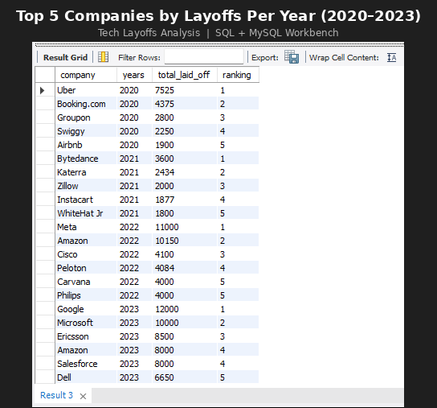

# Tech Layoffs Analysis (2020–2023)

## Project Overview
This project analyzes global tech industry layoffs from 2020 to 2023 using SQL.
The goal was to identify which companies laid off the most employees each year
and uncover trends across industries and time periods.

## Dataset
- **Source:** Alex The Analyst – World Layoffs Dataset
- **Tool:** MySQL Workbench

## Objectives
- Clean and prepare raw layoff data for analysis
- Identify the top 5 companies with the highest layoffs per year
- Spot trends in which industries and company types were most affected

## Data Cleaning Steps
- Removed duplicate records
- Standardized company names and industry labels
- Handled null and blank values
- Formatted date columns for time-series analysis

## Key SQL Concepts Used
- Common Table Expressions (CTEs)
- Window Functions (`DENSE_RANK() OVER (PARTITION BY year)`)
- Aggregate Functions (`SUM`, `GROUP BY`)
- Data cleaning with `TRIM`, `UPDATE`, and `IS NULL`

## Results – Top 5 Companies Laid Off Per Year

| Rank | 2020 | 2021 | 2022 | 2023 |
|------|------|------|------|------|
| 1 | Uber (7,525) | Bytedance (3,600) | Meta (11,000) | Google (12,000) |
| 2 | Booking.com (4,375) | Katerra (2,434) | Amazon (10,150) | Microsoft (10,000) |
| 3 | Groupon (2,800) | Zillow (2,000) | Cisco (4,100) | Ericsson (8,500) |
| 4 | Swiggy (2,250) | Instacart (1,877) | Peloton (4,084) | Amazon (8,000) |
| 5 | Airbnb (1,900) | WhiteHat Jr (1,800) | Carvana/Philips (4,000) | Salesforce/Dell (6,650+) |

## Results Preview

## Key Insights
- **2020** was dominated by travel and gig economy companies reacting to COVID-19
- **2021** saw smaller, startup-heavy layoffs as funding tightened
- **2022–2023** shifted dramatically to Big Tech, with Google, Meta, Microsoft, and Amazon accounting for tens of thousands of cuts
- Layoff volumes more than doubled from 2020 to 2023 at the top company level

## Files
- `data_cleaning.sql` – All cleaning steps
- `exploratory_analysis.sql` – EDA queries
- `top5_per_year.sql` – Final ranking query

## Author
Built following the Alex The Analyst SQL project series as part of my data analytics portfolio.
